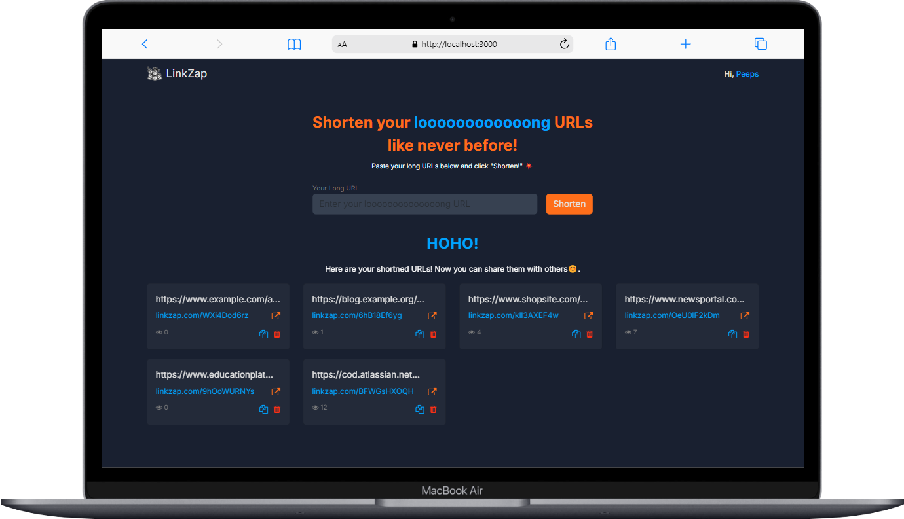
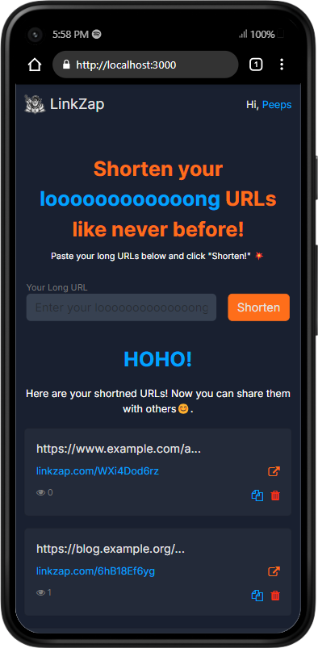

#  LinkZap


[](https://golang.org)
[](https://github.com/gin-gonic/gin)
[](https://reactjs.org/)
[](https://www.mongodb.com/)

LinkZap is a simple and efficient URL shortener built with a Golang backend, utilizing the Gin framework and MongoDB as the database. The frontend is crafted with React to provide a clean and user-friendly interface.

<div align="center">
    
    
</div>

## Features
- **URL Shortening**: Convert long URLs into short, easy-to-share links.
- **Custom URLs**: Create personalized short URLs.
- **Analytics**: Track the number of clicks on each shortened URL.
- **Responsive UI**: Beautiful and responsive user interface built with React.
- **Secure and Scalable**: Powered by Gin and MongoDB for high performance and security.

## Installation

### Backend (Golang)
1. Clone the repository:
   ```bash
   git clone https://github.com/Ashwin202/linkzap.git
   cd linkzap/backend
   ```
2. Install dependencies:
   ```bash
   go mod tidy
   ```
3. Set up MongoDB:
   - Ensure MongoDB is installed and running on your machine or running in your docker container.

4. Run the server:
   ```bash
   go run main.go
   ```

### Frontend (React)
1. Navigate to the frontend directory:
   ```bash
   cd ../frontend
   ```
2. Install dependencies:
   ```bash
   npm install
   ```
3. Start the React application:
   ```bash
   npm start
   ```

## Usage
Once both the backend and frontend are running, you can access LinkZap through your browser at `http://localhost:3000`. 

1. Enter a long URL in the input field.
2. Click on "Shorten"
3. Copy the generated short URL and share it!
